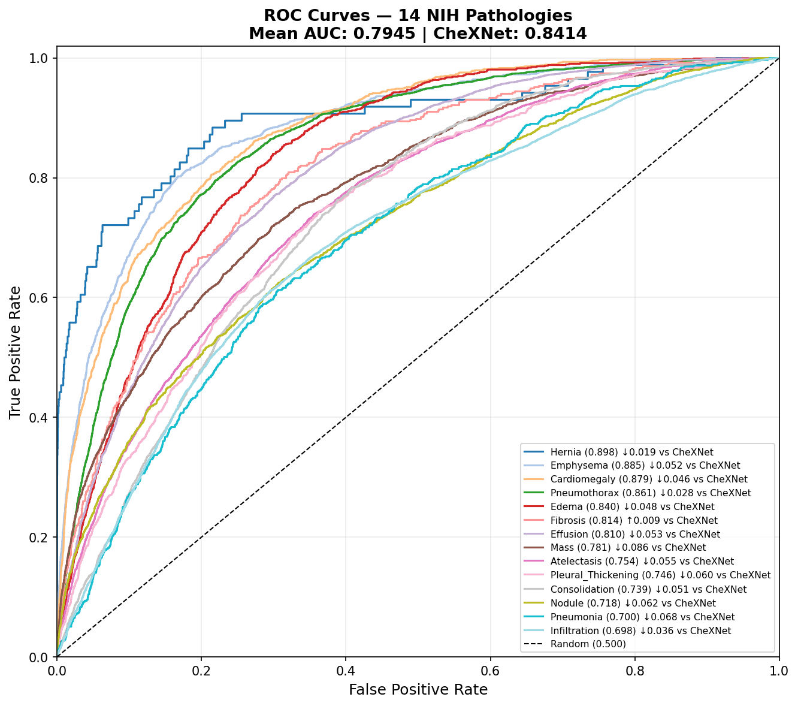
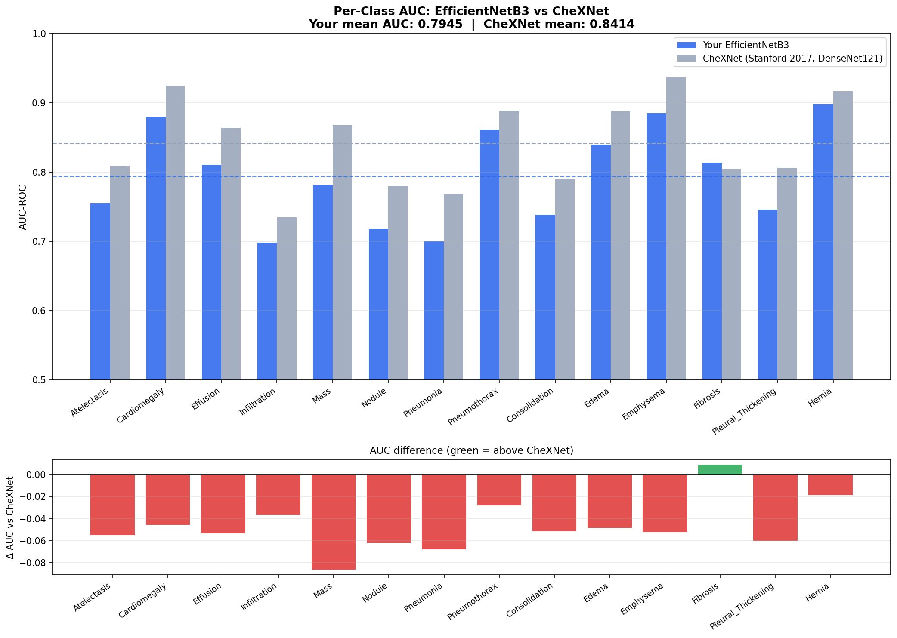

# ThoraXplain — Multi-Label Chest X-Ray Disease Detection with Explainable AI

**EfficientNetB3 · 14-Class Multi-Label Classification · Grad-CAM · NIH ChestX-ray14 · Streamlit**

> Train a CNN to detect 14 thoracic pathologies from a single chest X-ray — not just
> "sick vs. healthy," but *which* of 14 specific diseases are present, since a single
> scan can show multiple conditions at once. Every prediction comes with a Grad-CAM
> heatmap showing exactly which region of the lung the model used to make its call.

---

## Results — Held-Out Test Set (25,596 images)

| Metric | This Model | CheXNet (Stanford, 2017, DenseNet121) |
|---|---|---|
| **Mean AUC-ROC (14 classes)** | **0.7945** | 0.8414 |
| Best validation mean AUC (Phase 2) | 0.82 | — |
| Decision threshold | 0.50 | 0.50 |
| Test set size | 25,596 images | 25,596 images (same official split) |

A held-out test mean AUC of **0.7945** against a single, fixed decision threshold,
trained with a more parameter-efficient backbone (EfficientNetB3, 12M params) than
CheXNet's DenseNet121 (8M params, but trained with substantially more compute and
tuning by the original Stanford team). The gap from validation (0.82) to test (0.79)
is expected and worth understanding, not hiding: the validation set is a 15% patient-level
subset of the train pool used for model selection and early stopping, so it carries a
small optimistic bias; the official 25,596-image test split is the unbiased estimate of
real-world generalization, and it's the number that should be quoted.

### Per-class breakdown

| Pathology | AUC (Mine) | AUC (CheXNet) | Δ vs CheXNet | Recall | Precision | F1 |
|---|---|---|---|---|---|---|
| Hernia | 0.898 | 0.916 | −0.019 | 43.0% | 32.2% | 0.368 |
| Emphysema | 0.885 | 0.937 | −0.052 | 82.2% | 15.8% | 0.265 |
| Cardiomegaly | 0.879 | 0.925 | −0.046 | 78.3% | 14.7% | 0.247 |
| Pneumothorax | 0.861 | 0.889 | −0.028 | 85.3% | 25.8% | 0.396 |
| Edema | 0.840 | 0.888 | −0.048 | 87.2% | 8.8% | 0.159 |
| **Fibrosis** | **0.814** | 0.805 | **+0.009** | 58.6% | 6.2% | 0.112 |
| Effusion | 0.810 | 0.864 | −0.053 | 85.7% | 32.1% | 0.467 |
| Mass | 0.781 | 0.868 | −0.086 | 71.5% | 15.0% | 0.249 |
| Atelectasis | 0.754 | 0.809 | −0.055 | 78.4% | 21.9% | 0.343 |
| Pleural Thickening | 0.746 | 0.806 | −0.060 | 70.2% | 9.0% | 0.160 |
| Consolidation | 0.739 | 0.790 | −0.051 | 87.7% | 11.1% | 0.198 |
| Nodule | 0.718 | 0.780 | −0.062 | 65.4% | 11.5% | 0.196 |
| Pneumonia | 0.700 | 0.768 | −0.068 | 64.5% | 4.0% | 0.074 |
| Infiltration | 0.698 | 0.735 | −0.036 | 81.0% | 31.0% | 0.449 |
| **Mean** | **0.7945** | **0.8414** | **−0.0469** | — | — | — |

**Fibrosis is the one class where this model beats the CheXNet benchmark.** Hernia is
the strongest overall class (AUC 0.898) despite having the lowest prevalence in the
dataset (~0.2%) — the pos_weight-driven loss is doing its job there.

The low precision/F1 numbers on rare classes (Pneumonia: 4.0% precision, Hernia: 32.2%
recall) are an expected consequence of using one fixed 0.5 threshold across 14 classes
with wildly different prevalence (0.2%–20%), combined with a loss function deliberately
biased toward recall via `pos_weight`. **Per-class threshold tuning (Youden's J statistic)
is the documented next step** — see [Known Limitations](#known-limitations--future-work).

<p align="center">
  
  
</p>

---

## Architecture

```
INPUT: Chest X-ray (any size, grayscale or RGB) → Resize 256 → CenterCrop 224

EfficientNetB3 Backbone (ImageNet-pretrained, 12M params)
  Stage 0    : Conv stem,        3   →  40    [FROZEN — Phase 1, frozen — Phase 2]
  Stages 1–4 : MBConv blocks,   40   → 384    [FROZEN — Phase 1, frozen — Phase 2]
  Stages 5–7 : MBConv blocks,  384   → 384    [FROZEN — Phase 1, UNFROZEN — Phase 2]
  Stage 8    : Head conv,      384   → 1536   [FROZEN — Phase 1, UNFROZEN — Phase 2]

Custom Head
  AdaptiveAvgPool2d → Dropout(0.4) → Linear(1536 → 14)

OUTPUT: Sigmoid applied independently per class → 14 × P(pathology) in [0, 1]
        (multi-label — multiple diseases can co-occur on one scan; "No Finding"
        is implicit when every probability stays below threshold)

Grad-CAM: hooks on features[-1] (the head conv) → [7×7] importance map per class
          → upsampled to 224×224, overlaid on the original X-ray
```

**Why EfficientNetB3:** it scales width, depth, and input resolution jointly via a
compound coefficient, reaching strong ImageNet accuracy with roughly half the
parameters of a comparable ResNet50 — meaningful when the deployment target is
CPU-based inference (Hugging Face Spaces free tier, Streamlit), not a GPU server farm.

### Two-phase transfer learning

| Phase | Epochs | Learning Rate | Unfrozen | Why |
|---|---|---|---|---|
| **Phase 1** | 5 | 1e-3 | Classifier head only | A randomly initialized head produces noisy gradients in epoch 1; training it alone first prevents those gradients from corrupting good pretrained ImageNet features in the backbone. |
| **Phase 2** | 10 | 1e-4 (cosine annealed) | Top 3 MBConv stages + head conv + classifier | Lets the highest-level, most semantic features adapt from generic ImageNet textures to chest-X-ray-specific patterns. Early layers (edges, basic textures) stay frozen — they're universal and don't need retraining. |

Both phases use AdamW (weight decay 1e-4), gradient clipping (max norm 1.0), and
mixed-precision training (`torch.amp`) for memory and speed headroom on a single
Kaggle T4 GPU at batch size 16.

---

## Dataset

[NIH ChestX-ray14](https://www.kaggle.com/datasets/nih-chest-xrays/data) — 112,120
frontal-view chest X-rays from 30,805 unique patients, released by the NIH Clinical
Center. Each image is labeled with zero, one, or several of 14 pathologies (multi-label,
not multi-class), extracted via NLP from radiology reports.

| Split | Images | Source | Notes |
|---|---|---|---|
| Train | ~73,000 | 85% of official `train_val_list.txt`, by patient | Patient-level split |
| Val | ~13,500 | 15% of official `train_val_list.txt`, by patient | Used for early stopping / model selection |
| Test | 25,596 | Official `test_list.txt` (untouched) | Never resplit, never seen during training |

**Per-class prevalence ranges from ~20% (Infiltration, the most common finding) down
to ~0.2% (Hernia, the rarest)** — a roughly 100x imbalance between the most and least
common pathology, which directly motivates the class-weighting strategy below.

### Why the split is done by *patient*, not by *image*

NIH ChestX-ray14 contains repeat scans — a single patient can have 5–10 follow-up
X-rays in the dataset. A naive random split at the *image* level can place several
scans from the same patient in both train and test simultaneously. When that happens,
the model can partially learn to recognize *that patient's specific anatomy* rather
than the underlying disease pattern — and test AUC ends up inflated by an estimated
5–10 points versus a properly leakage-free split. This project uses the NIH-provided
official `test_list.txt` as a held-out set exactly as released, and performs its own
*patient-level* split (via `sklearn.train_test_split` on unique `Patient ID`, not row
index) for the train/val division — every image belonging to a given patient lands in
exactly one split, never both.

---

## Handling Extreme Class Imbalance

Two loss functions are implemented behind a single `get_loss_fn(name, pos_weight)`
factory:

**Weighted BCE (default).** `BCEWithLogitsLoss(pos_weight=...)`, where `pos_weight`
is computed per class as `n_negative / n_positive` from the training set. For a class
like Pneumonia (~1.3% prevalence, roughly 1,100 positive images out of ~74,000),
this works out to a pos_weight near 66 — a single missed Pneumonia case during training
costs the loss function roughly 66x more than a single false alarm. Without this,
gradient descent finds the trivial low-loss solution of predicting "no disease" for
every rare class and never escapes it.

**Focal Loss (optional, `--loss focal`).** `FL(p) = -α·(1−p_t)^γ·log(p_t)`, where `p_t`
is the model's predicted probability for the *true* class. Unlike `pos_weight`, which
only accounts for class frequency, focal loss down-weights *easy, already-confident*
predictions regardless of class — forcing continued learning from hard examples. This
is the recommended option for the hardest, rarest classes (Pneumonia, Hernia) where
weighted BCE alone still struggles.

---

## Grad-CAM Explainability

A black-box model that outputs "73% Cardiomegaly" is not deployable in a clinical
context — a radiologist needs to see *why*. Grad-CAM (Selvaraju et al., 2017) is
implemented from scratch using PyTorch forward/backward hooks (no external library
dependency for the core algorithm):

1. A forward hook captures the activation maps from the final convolutional layer
   (`features[-1]`, 1536 channels at 7×7 spatial resolution).
2. A backward pass is run on the *target class's* raw logit (not the loss) to capture
   gradients at that same layer.
3. Gradients are global-average-pooled per channel to produce per-channel importance
   weights, which scale and sum the activation maps.
4. A ReLU keeps only positive influence; the result is upsampled from 7×7 to 224×224
   and normalized to [0, 1] for overlay.

Because this requires a backward pass, Grad-CAM generation cannot run inside
`torch.no_grad()` — a deliberate departure from how every other inference path in this
project is written, and a detail worth knowing cold.

The Streamlit app lets a user regenerate the heatmap for *any* of the 14 pathologies
on a given scan, not just the top prediction — useful for inspecting whether a
secondary, lower-confidence finding is anatomically plausible.

---

## Project Structure

```
thoraxplain/
├── src/
│   ├── config_nih.py     ← single source of truth for NIH hyperparameters & paths
│   ├── dataset_nih.py    ← NIHChestXrayDataset, patient-level split, pos_weight
│   ├── model.py          ← EfficientNetB3 + head, freeze/unfreeze (shared, binary + NIH)
│   ├── losses.py         ← WeightedBCELoss, FocalLoss, get_loss_fn() (shared)
│   ├── train_nih.py      ← val_epoch_nih(), run_training_nih() — two-phase orchestration
│   ├── evaluate_nih.py   ← per-class AUC/F1/precision/recall, ROC + AUC comparison plots
│   ├── gradcam.py        ← GradCAM class, overlay_heatmap() (shared, binary + NIH)
│   └── utils.py          ← seed, device, checkpoint save/load, logging, AUC table
├── app/
│   ├── main.py           ← Streamlit entry point
│   ├── inference.py      ← ML backend (zero Streamlit imports — independently testable)
│   ├── ui_components.py  ← reusable Streamlit UI building blocks
│   └── styles.css        ← custom CSS
├── tests/                ← pytest suite (95+ tests, synthetic fixtures, no GPU/network needed)
│   ├── test_dataset_nih.py
│   ├── test_model.py
│   ├── test_losses.py
│   ├── test_gradcam.py
│   └── test_evaluate.py
├── assets/nih/
│   ├── roc_curves_14class.png
│   ├── auc_comparison_chexnet.png
│   └── evaluation_results_nih.json
├── notebooks/
│   ├── 01_eda.ipynb                    ← exploratory analysis (original binary dataset)
│   └── NIH_KAGGLE_TRAINING.ipynb       ← end-to-end Kaggle training run, with gate checks
├── run_training_nih.py   ← CLI training entry point
├── run_evaluation_nih.py ← CLI evaluation entry point
└── requirements.txt
```

---

## Quick Start

### 1. Install dependencies
```bash
pip install -r requirements.txt
```

### 2. Download the dataset
The full NIH ChestX-ray14 dataset is ~45GB. On Kaggle, attach the
[`nih-chest-xrays/data`](https://www.kaggle.com/datasets/nih-chest-xrays/data) dataset
directly to a notebook — no download required. Locally:
```bash
kaggle datasets download -d nih-chest-xrays/data -p data/nih_chestxray --unzip
```
Expected layout: `images/` (112,120 flat PNGs), `Data_Entry_2017_v2020.csv`,
`train_val_list.txt`, `test_list.txt`.

### 3. Run the test suite first (no GPU needed)
```bash
pytest tests/ -v
```

### 4. Smoke test (1 epoch, no pretrained download, no W&B — verifies the pipeline runs)
```bash
python run_training_nih.py --data-root data/nih_chestxray \
    --epochs1 1 --epochs2 0 --no-wandb --no-pretrained
```

### 5. Train for real (Phase 1 + Phase 2)
```bash
python run_training_nih.py --data-root data/nih_chestxray
```
On a Kaggle T4: Phase 1 (5 epochs) ≈ 1–1.5 hr, Phase 2 (10 epochs) ≈ 3–4 hr at batch
size 16. Use `--loss focal` to switch to focal loss for the rarest classes.

### 6. Evaluate on the held-out test set
```bash
python run_evaluation_nih.py --checkpoint checkpoints/best_model.pth
```
Saves `roc_curves_14class.png`, `auc_comparison_chexnet.png`, and
`evaluation_results_nih.json` to `assets/nih/`.

### 7. Launch the app
```bash
streamlit run app/main.py
```

---

## Deploying to Hugging Face Spaces (free)

```bash
# 1. Upload model weights to HF Hub
pip install huggingface-hub
huggingface-cli login
huggingface-cli upload YOUR_USERNAME/thoraxplain-efficientnet checkpoints/best_model.pth

# 2. Create a Space at huggingface.co → New Space → SDK: Streamlit → CPU Basic (free)

# 3. In app/inference.py, replace load_model() with:
from huggingface_hub import hf_hub_download
weights = hf_hub_download(repo_id="YOUR_USERNAME/thoraxplain-efficientnet", filename="best_model.pth")
model, device = load_model(weights)

# 4. git push to your HF Space repo → auto-deploys in ~3 min
```

---

## Running Tests

```bash
# Full suite
pytest tests/ -v

# With coverage
pytest tests/ --cov=src --cov-report=term-missing
```

95+ tests across dataset (patient-leakage checks, label parsing, pos_weight math),
model (architecture, freeze/unfreeze stage boundaries), losses (focal loss math
verification), Grad-CAM (hook lifecycle, stale-activation checks), and evaluation
(metric correctness against sklearn). All tests run with `pretrained=False` and
synthetic fixtures — no GPU and no network access required.

---

## Known Limitations & Future Work

- **No per-class threshold tuning.** All 14 classes currently share one fixed 0.5
  decision threshold for precision/recall/F1 reporting. Given prevalence ranges from
  0.2% to 20%, this produces very low precision on rare classes (e.g. Pneumonia: 4%).
  Per-class thresholds via Youden's J statistic (already scaffolded in `evaluate_nih.py`)
  would substantially improve reported F1 without touching the underlying model.
- **Gap to CheXNet (0.79 vs 0.84 mean AUC).** Likely contributors: fewer total epochs
  than the original CheXNet training run, no test-time augmentation, and a smaller
  unfreeze window in Phase 2 (top 3 MBConv stages vs. full fine-tuning). Worth testing:
  more Phase 2 epochs, focal loss as the default rather than the optional path, and
  TTA (horizontal-flip averaging) at inference time.
- **Single fixed image resolution (224×224).** Some pathologies (e.g. small nodules)
  may benefit from higher input resolution at the cost of training/inference speed.
- **CPU-only inference target.** The Streamlit/HF Spaces deployment assumes free-tier
  CPU inference, which constrains batch size and rules out heavier backbones or
  ensembling for now.

---

## Why This Project Stands Out in an Interview

- **AUC-ROC, not accuracy.** With Hernia at 0.2% prevalence, predicting "no Hernia"
  for every single image scores 99.8% accuracy and is useless. AUC measures ranking
  ability independent of any one threshold — the correct metric for this kind of
  imbalance, and the one the original CheXNet paper itself reports.
- **Patient-level split, not image-level.** A well-known and easy-to-miss source of
  inflated metrics in medical ML — implemented here and directly verified by a
  dedicated pytest test (`test_no_patient_overlap_train_val`), not just claimed.
- **Multi-label, not multi-class.** A single chest X-ray can show Cardiomegaly *and*
  Effusion simultaneously — handled with independent per-class sigmoid outputs and
  `BCEWithLogitsLoss`, not a softmax over mutually-exclusive classes.
- **Grad-CAM implemented from first principles**, using raw PyTorch hooks rather than
  an off-the-shelf library — demonstrates the underlying mechanism is actually
  understood, not just imported.
- **Two-phase training** prevents catastrophic forgetting of ImageNet features by
  training the head alone before touching the pretrained backbone.
- **Benchmarked against a named, citable paper** (Rajpurkar et al. 2017, CheXNet) on
  the same dataset and the same official test split, per-class — not a vague
  "the model works well" claim.

---

## Interview Quick-Reference

**"Tell me about your best project."**
> "I built a multi-label classifier that detects 14 different thoracic diseases from
> a single chest X-ray, using EfficientNetB3 trained on the NIH ChestX-ray14 dataset —
> about 112,000 images. The hardest part was class imbalance: some pathologies like
> Hernia appear in under half a percent of the data, so I used inverse-frequency
> weighted BCE loss, with focal loss as a fallback for the rarest classes. I also made
> sure to split by patient rather than by image, since NIH has repeat scans per
> patient and a naive split leaks data between train and test. My held-out test mean
> AUC across all 14 classes was 0.79, compared to the original Stanford CheXNet paper's
> 0.84 on the same dataset and test split — and I actually beat their benchmark on
> Fibrosis specifically. The feature I'm most proud of is Grad-CAM, which I implemented
> from raw PyTorch hooks rather than a library, so for any prediction the model can
> show exactly which region of the lung drove that decision."

**"Why EfficientNetB3 over a deeper ResNet or DenseNet?"**
> "EfficientNet scales width, depth, and resolution together using a single compound
> coefficient, which gets you strong ImageNet performance with far fewer parameters —
> roughly 12 million versus 25 million for ResNet50. Since my deployment target is
> CPU-based inference on Hugging Face Spaces' free tier, that parameter efficiency
> directly translates to faster, cheaper inference without sacrificing much accuracy."

**"Why is your AUC lower than CheXNet's?"**
> "A few likely factors: I trained for fewer total epochs given my Kaggle GPU budget,
> I didn't use test-time augmentation, and in Phase 2 I only unfroze the top three
> MBConv blocks rather than fine-tuning the entire backbone — a deliberate trade-off
> to control training time and reduce overfitting risk on certain rare classes. Those
> are the first three things I'd try to close the gap if I had more compute budget."

---

*Built with PyTorch · EfficientNetB3 · Grad-CAM (from scratch) · Streamlit · Weights & Biases*
